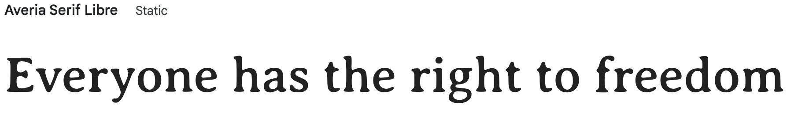
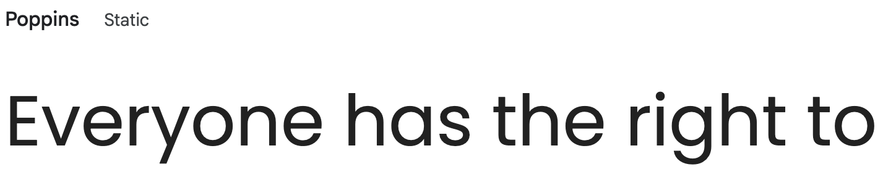

# [RemindiCare](https://remindicare-c84864436945.herokuapp.com/)

The RemindiCare project is a comprehensive solution designed to assist users in managing their medication schedules effectively. As an innovative application, RemindiCare addresses the crucial need for a reliable and user-friendly platform to ensure medication adherence, which is a significant concern in healthcare management. By providing a suite of functionalities, including registration, user authentication, medication schedule management, reminders, tracking, logging, and analytics, RemindiCare aims to enhance the overall user experience and support both patients and caregivers in maintaining optimal health outcomes.

<div align="center">
  
</div>

[](https://github.com/JohnnySonTrinh/remindicare/commits/main)
[](https://github.com/JohnnySonTrinh/remindicare/commits/main)
[](https://github.com/JohnnySonTrinh/remindicare)
---

## Table of content

- [User Experience](#user-experience)
	- [Initial Dicsussion](#initial-discussion)
	- [User Stories](#user-stories)
	- [Project Goals](#project-goals)
- [Design](#design)
	- [Wireframes](#wireframes)
	- [Database Design](#database-design)
	- [Color Scheme](#color-scheme)
	- [Typography](#typography)
- [Features](#features)
- [Future Features](#future-features) 
- [Tools & Technologies Used](#tools-&-technologies-used)
- [Testing](#testing)
- [Deployment](#deployment)
- [Credits](#credits)
---

## User Experience

### Initial Discussion

- Medication adherence is critical for the successful treatment of various health conditions, yet it is often challenging for patients to remember to take their medications consistently.
- Non-adherence can lead to severe health complications, increased healthcare costs, and reduced quality of life.
- RemindiCare seeks to mitigate these issues by offering a robust and intuitive app that not only reminds users to take their medications but also allows them to log and track their intake, view adherence patterns, and share important data with their healthcare providers.

### User Stories

- All user stories are mapped to Issues in Github, with acceptance criteria and tasks.
- We tracked the issues with a Github Project [progress board](https://github.com/users/JohnnySonTrinh/projects/7) and grouped them into Epics so that we could follow Agile methodology.

### Project Goals

- The main goal of RemindiCare is to create an simple, intuitive and reliable medication management app to enhance user adherence and support healthcare needs.
- Designed with a user-centric approach, the app aims to meet the needs of patients, caregivers, and healthcare providers.
- By leveraging a well-designed database, RemindiCare ensures that all user data is managed effectively.
---

## Design

### Wireframes
- To follow best practice and ensure that our site will look good on all screensizes, wireframes were developed for mobile and desktop sizes. 
  - We used [Balsamiq](https://balsamiq.com/wireframes) and [Figma](https://www.figma.com/design/M7sAzpW0rdoQYFe8Wh78Re/RemindiCare?node-id=0-1&t=Cd9Tcfz4qpEbdWce-0) to design our app wireframes.

<!-- Add Screenshot of wireframes -->

<details>
  <summary>Click to view Wireframes</summary>
    
    
</details>

### Database Design
- This database uses a Postgres database form Code Institute.
<details>
  <summary>Click to view ER Diagram</summary>
    
</details>

### Color Scheme

- For the RemindiCare project, we have thoughtfully incorporated the color scheme of the partnering company to ensure a cohesive and professional appearance.
- By aligning our app’s design with the company's established visual identity, we aim to create a seamless and recognizable user experience.

<details>
  <summary>Click to view color palett</summary>
    
</details>
<br>

We used CSS `:root` variables to easily update the global colour scheme by changing only one value, instead of everywhere in the CSS file.


```css
:root {
  --clr-green: #2a834e;
  --clr-orange: #d15b21;
  --clr-cream: #f7efe9;
  --clr-blue: #00c1f3;
  --clr-purple: #531295;
  --clr-grey-1: hsl(208, 14%, 56%);
  --clr-grey-2: hsl(208, 10%, 37%);
  /* White/black color shades */
  --clr-white: #ffffff;
  --clr-black: #111111;
  /* Primary and secondary font families */
  --ff-primary: "Averia Serif Libre", serif;
  --ff-secondary: "Poppins", sans-serif;
  /* Commonly used CSS properties for consistency */
  --transition: all 0.3s linear;
  --spacing: 0.25rem;
  --radius: 0.5rem;
  --light-shadow: 0 5px 15px rgba(0, 0, 0, 0.1);
}
```

#### Typography

We used Google Fonts for this project. The titles are Averia serif libre.
<div align="left">
  
</div>

The main font is Poppins, which is clear and easy to read, for accessibility:

<div align="left">
  
</div>

---

## Features
ToDo!


---

## Future Features

<!-- These are all the awesome things that the page will have in the future -->
---

## Tools & Technologies Used

- [](https://git-scm.com) used for version control. (`git add`, `git commit`, `git push`)
- [](https://github.com) used for secure online code storage.
- [](https://gitpod.io) used as a cloud-based IDE for development.
- [](https://en.wikipedia.org/wiki/HTML) used for the main site content.
- [](https://en.wikipedia.org/wiki/CSS) used for the main site design and layout.
- [](https://www.javascript.com) used for user interaction on the site.
- [](https://www.python.org) used as the back-end programming language.
- [](https://www.heroku.com) used for hosting the deployed back-end site.
- [](https://www.djangoproject.com) used as the Python framework for the site.
- [](https://www.postgresql.org) used as the relational database management.
- [](https://whitenoise.readthedocs.io) used for serving static files with Heroku.
- [](https://aws.amazon.com/s3) used for online static file storage.
- [](https://balsamiq.com/wireframes) used for creating wireframes.
- [](https://www.canva.com/p/canvawireframes) used for creating wireframes.
- [](https://getbootstrap.com) used as the front-end CSS framework for modern responsiveness and pre-built components.
- [](https://fontawesome.com) used for the icons.
- [](https://chat.openai.com) used to help debug, troubleshoot, and explain things.
---
## Credits

Todo!

Thanks to the whole team!
